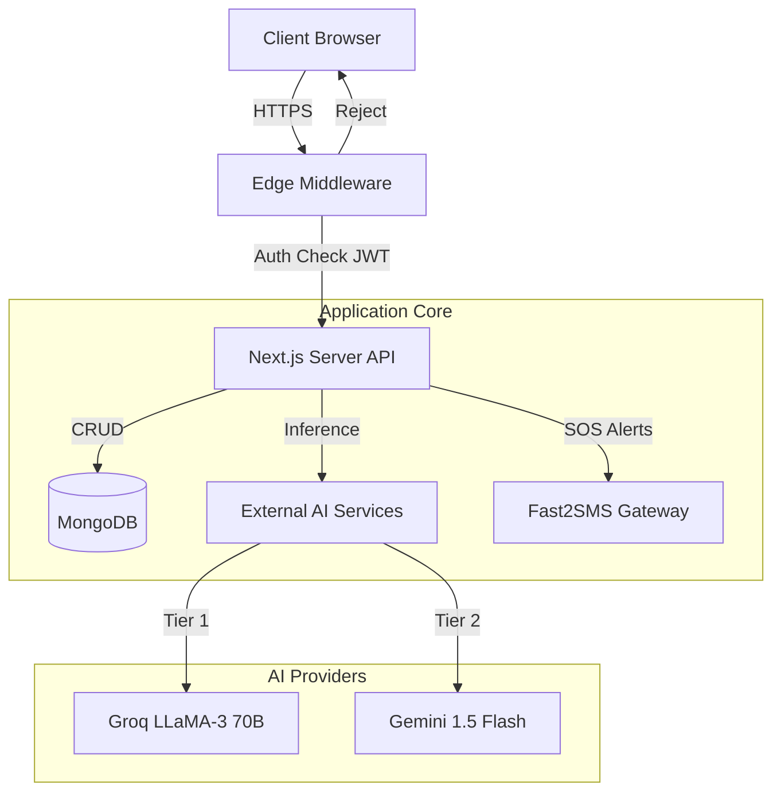
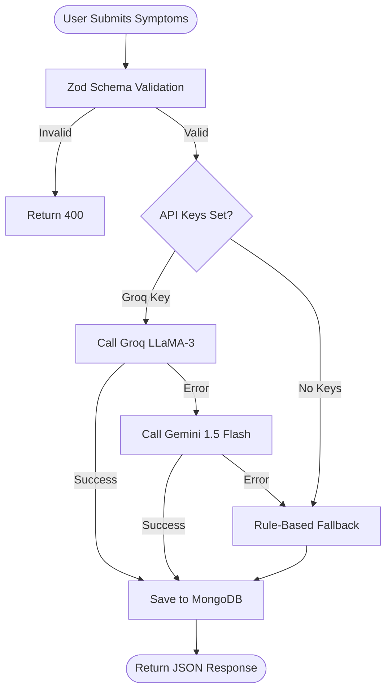
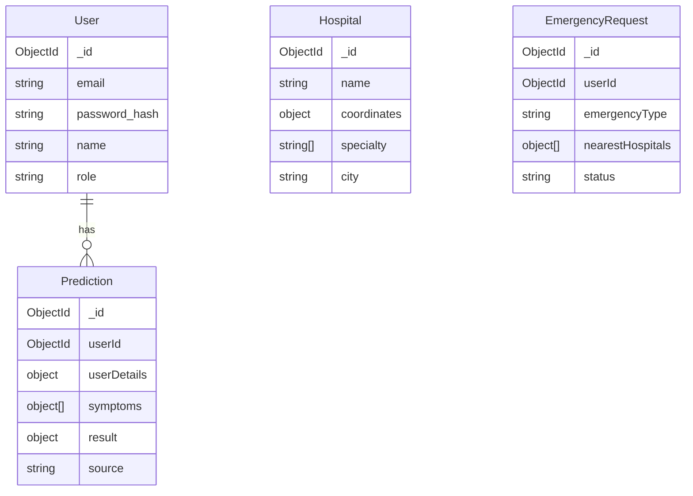
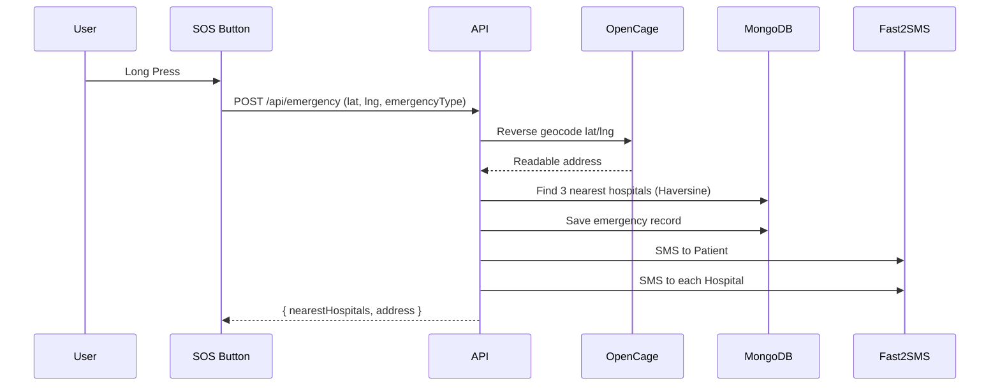

# 🏗️ Medicare AI - Architecture & Engineering Documentation

## 1. System Overview

Medicare AI is a Next.js 16 application providing AI-driven medical predictions. It uses a hybrid architecture of serverless API routes, Edge middleware for security, and MongoDB for persistence.

The **Tri-Engine Prediction System** routes to Groq LLaMA-3, Gemini, or a deterministic rule-based fallback depending on availability.

---

## 2. High-Level Architecture

---

## 3. 🧠 Prediction Engine Logic

The `Prediction Orchestrator` (`lib/prediction/orchestrator.ts`) routes user requests.

---

## 4. 🗄️ Database Schema

---

## 5. 🚨 Emergency SOS Pipeline

---

## 6. 🔒 Security Architecture

1. **HttpOnly Cookies** — JWT never exposed to JavaScript
2. **Edge Middleware** — Authentication happens at CDN edge before pages render
3. **Content Security Policy** — Headers injected in `middleware.ts`
4. **Zod Validation** — All API inputs strictly typed and validated
5. **`force-dynamic`** — All user data endpoints must export `export const dynamic = 'force-dynamic'` to prevent response caching

---

## 7. 📁 Directory Map

| Path | Purpose |
|---|---|
| `app/api/predictions` | Core prediction POST endpoint |
| `app/api/emergency` | SOS alert handler (Fast2SMS + OpenCage) |
| `app/api/youtube` | YouTube Data API v3 proxy |
| `app/api/medical-evidence` | PubMed NCBI clinical evidence proxy |
| `app/api/medlineplus` | MedlinePlus specialty summary proxy |
| `app/api/admin/outbreak-stats` | disease.sh India stats |
| `lib/prediction/orchestrator.ts` | AI → Rule fallback routing |
| `lib/prediction/rule-based.ts` | Offline deterministic fallback engine |
| `lib/ai/providers.ts` | Groq + Gemini API wrappers |
| `lib/alerts/sms-india.ts` | Fast2SMS dispatch utility |
| `lib/geocoder.ts` | OpenCage reverse geocoder |
| `lib/auth/jwt.ts` | JWT sign/verify via jose |
| `lib/db/mongodb.ts` | MongoDB singleton connection |
| `lib/db/schemas.ts` | TypeScript types for all collections |
| `middleware.ts` | Edge security, JWT guard, CSP |
| `docs/ARCHITECTURE.md` | This document |
| `AI_CONTEXT.md` | AI agent onboarding context |
